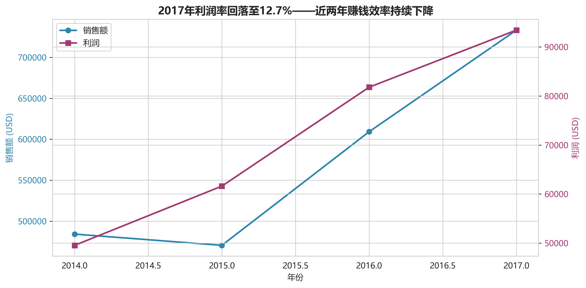
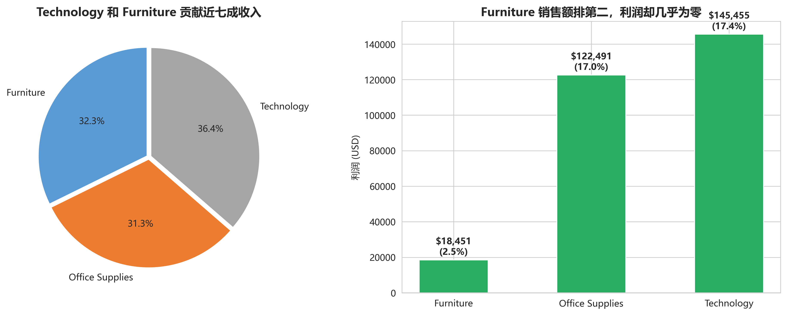
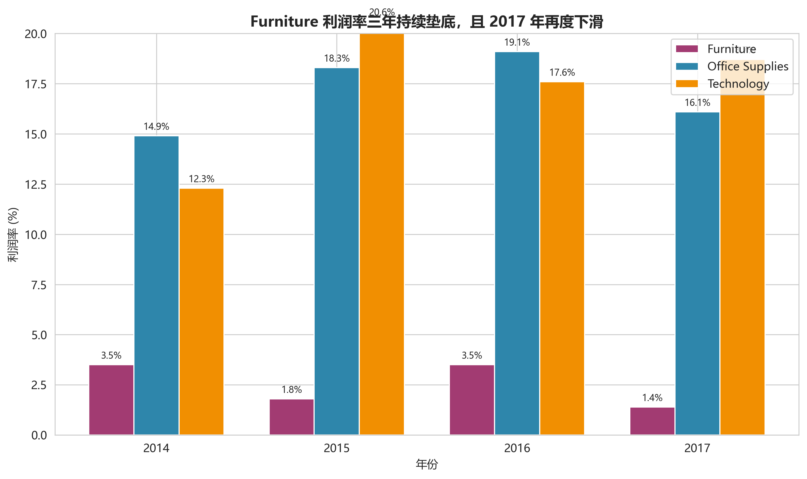
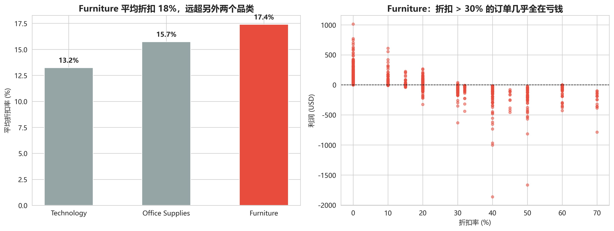
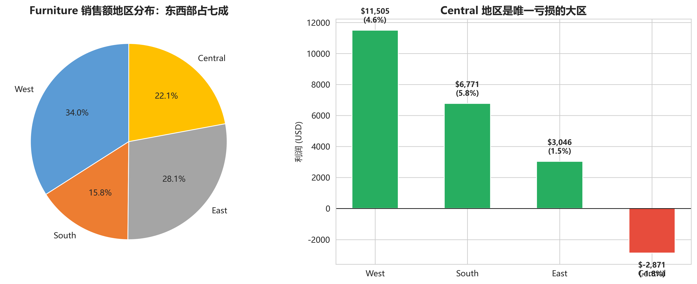
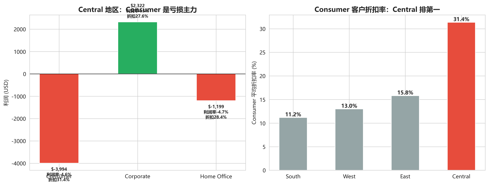
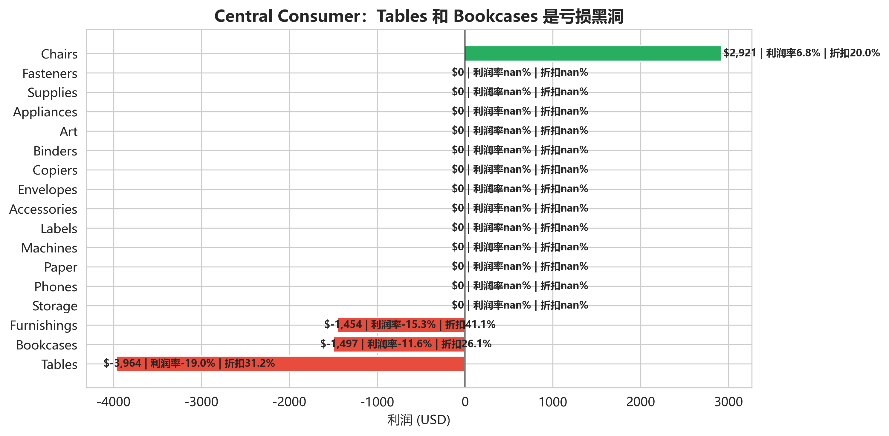
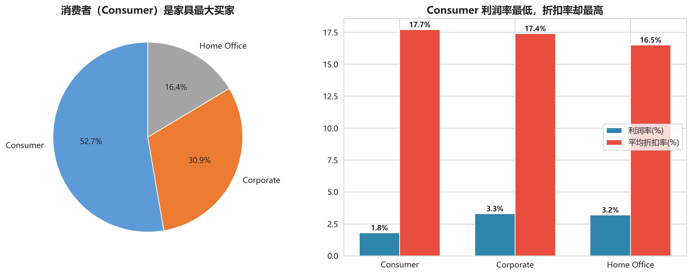

# Furniture品类亏损分析

  基于9994条零售订单数据，通过利润分析、折扣分析和区域分析，定位Furniture品类亏损原因，并提出可落地的经营优化方案。

## 项目亮点
- 分析9994条订单数据
- 发现Furniture利润率仅2.5%
- 定位Central地区与Tables子品类为主要亏损来源
- 建立定价策略验证模型
- 输出商业改进方案
## 一、项目背景
## 项目背景

虽然公司整体销售额持续增长，但利润增长逐渐放缓。

其中Furniture品类销售额接近Technology，但利润贡献极低。

本项目重点分析Furniture品类亏损原因。

## 二、数据来源
- **数据集**：Sample - Superstore.csv（经典电商零售公开数据集）
- **数据规模**：9994条订单记录，21个字段
- **时间范围**：2014年1月3日至2017年12月30日（覆盖完整4年经营数据）
- **核心字段**：订单信息（订单ID、日期、发货方式）、客户信息（客户ID、细分类型、地区）、产品信息（品类、子品类、名称）、财务信息（销售额、数量、折扣、利润）

## 三、数据清洗
### 1. 数据质量基础检查
- **缺失值**：所有字段无缺失值，数据完整性良好
- **重复值**：无完全重复行；订单号重复为正常现象（同一订单包含多个商品），未做删除处理
- **数据类型转换**：
  - 将`Order Date`和`Ship Date`转换为datetime类型，验证所有发货日期晚于或等于订单日期
  - 将`Postal Code`转换为字符串类型并补全5位前导零
  - 将所有分类型字段（发货方式、客户细分、地区、品类等）转换为category类型以优化性能

### 2. 异常值处理
| 字段 | 异常情况 | 业务解释 | 处理方式 |
|------|----------|----------|----------|
| Sales | 127个离群值（占比1.27%） | 单笔金额超过$2099.59的大额交易 | 保留，属于正常业务场景 |
| Profit | 1871个负值（占比18.7%） | 亏损订单；107个离群值（大额盈亏） | 保留，为核心分析对象 |
| Discount | 300个离群值（占比3.0%） | 折扣率超过78%的超高折扣交易 | 保留，为核心分析对象 |

### 3. 数据质量结论
数据整体质量可靠，所有异常均有明确业务解释，无影响分析结论的系统性错误，可直接进入深度分析阶段。

## 四、可视化分析
### 1. 整体经营趋势分析
- **四年总业绩**：累计销售额$2,297,200.86，总利润$286,397.02，整体利润率12.47%
- **趋势变化**：2017年利润率回落至12.7%，利润增速（14.2%）已落后于销售额增速（20.4%），呈现"卖得越多赚得越少"的趋势

- **品类贡献**：Technology和Furniture贡献近七成收入，但利润贡献严重失衡

### 2. 三大品类盈利能力对比
| 品类 | 销售额 | 利润 | 利润率 |
|------|--------|------|--------|
| Technology | $836,154.03 | $145,454.95 | 17.4% |
| Office Supplies | $719,047.03 | $122,490.80 | 17.0% |
| Furniture | $741,999.80 | $18,451.27 | 2.5% |

- **核心问题**：Furniture品类销售额与另外两个品类相当，但利润仅为它们的零头，是拖累公司整体利润率的唯一原因
- **趋势恶化**：Furniture利润率三年持续垫底，2017年进一步下滑至1.4%

### 3. Furniture品类深度拆解
#### （1）折扣与利润的关系
- Furniture平均折扣17.4%，是Technology（13.2%）和Office Supplies（15.7%）的约1.2倍
- 折扣>30%的订单几乎全部亏损，折扣率与利润率呈显著负相关

#### （2）地区分布
- 销售额分布：West（34.0%）> East（28.1%）> Central（22.1%）> South（15.8%）
- 利润分布：West（$11,505）> South（$6,771）> East（$3,046）> **Central（-$2,871）**
- **关键发现**：Central是唯一亏损的大区，且Consumer客户平均折扣高达31.4%，是其他地区的2倍以上

#### （3）客户细分
- 销售额占比：Consumer（52.7%）> Corporate（30.9%）> Home Office（16.4%）
- 利润率对比：Corporate（3.3%）≈ Home Office（3.2%）> **Consumer（1.8%）**
- **关键发现**：占比过半的Consumer客户利润率最低，但折扣率最高（17.7%）

#### （4）子品类拆解（Central地区Consumer）
| 子品类 | 利润 | 利润率 | 平均折扣 |
|--------|------|--------|----------|
| Chairs | $2,921 | 6.8% | 20.0% |
| Furnishings | -$1,454 | -15.3% | 41.1% |
| Bookcases | -$1,497 | -11.6% | 26.1% |
| Tables | -$3,964 | -19.0% | 31.2% |

- **核心结论**：同样的地区和客户类型，Chairs能够盈利，说明问题不在于市场，而在于Tables、Bookcases和Furnishings的定价与折扣策略失控

### 4. 定价策略验证
以盈利健康的Chairs为基准（成本加成率1.3x，折扣率17%，利润率8.1%），对其他子品类进行模拟：
- Bookcases：采用相同加成率即可扭亏（利润率从-3.0%升至3.3%）
- Tables：需同时提升加成率至1.3x并将折扣降至17%，才能实现单件利润$15.95
- Furnishings：当前折扣虽高但利润空间充足，无需干预

## 五、关键发现
1.  **整体盈利能力持续恶化**：2017年利润增速跑输收入增速，赚钱效率逐年下降
2.  **Furniture是唯一亏损拖累**：四年仅赚$18,451，利润率2.5%，不到其他品类的1/6
3.  **Central地区是亏损重灾区**：四年累计亏损$2,871，Consumer客户平均折扣高达31.4%
4.  **三个亏损黑洞子品类**：Tables（总亏$17,725）、Bookcases（总亏$3,473）、Furnishings（Central地区亏$1,454）
5.  **根本原因是折扣失控**：销售团队考核以销售额为导向，倾向于用高折扣换取成交，尤其是高单价的家具产品
6.  **定价策略存在系统性问题**：Tables当前售价已低于成本，需同时提价和控折扣才能扭亏

## 六、业务建议
### 1. 两条可选改进路径
#### 路径A：快速止血方案 —— 分区域下架亏损产品
- **核心动作**：
  1.  立即停止Central和East地区Tables的销售，将库存转移至唯一盈利的West地区
  2.  剩余库存以不低于成本价的折扣（≤10%）限时清仓
  3.  对已下单客户引导更换为Chairs或提供10%额外折扣补偿
- **预期效果**：年度止损约$12,000，但损失约$100,000销售额
- **风险**：价格敏感客户大量流失，市场份额下降10%-15%
- **适用条件**：公司需要快速聚焦核心业务；或改造方案执行后销量下滑超80%

#### 路径B：长期改造方案 —— 全公司统一提价+控折扣
- **核心动作（分3步渐进执行）**：
  1.  **第1个月（测试期）**：将Tables和Bookcases的成本加成率提升至1.3x，折扣上限从26%降至25%，同步推出"免费安装+1年延长质保"非价格促销
  2.  **第2-3个月（调整期）**：若销量下滑≤50%，进一步将折扣上限降至20%
  3.  **第4-6个月（稳定期）**：最终稳定在Chairs的标准（1.3x加成率+17%折扣）
- **预期效果**：即使Central地区Tables销量下滑70%，年利润仍比当前高$1,907；若销量仅下滑50%，年利润可改善$2,226
- **风险**：高折扣依赖客户流失，短期销量大幅下滑
- **适用条件**：公司愿意承担短期阵痛以换取长期盈利健康；非价格促销能有效抵消部分价格敏感

### 2. 必做配套措施
1.  **考核机制改革**：将销售考核权重从"销售额60%+利润20%"调整为"利润50%+折扣率20%+销售额20%"，Central和East地区优先执行
2.  **供应商审计**：启动Tables和Bookcases的供应商谈判，目标将采购成本降低5%-10%，进一步扩大利润空间
3.  **Bookcases同步调价**：按照与Tables相同的节奏进行定价和折扣调整，解决其系统性亏损问题

### 3. 执行监控与风险红线
- **先行指标（1-3个月）**：Tables周度销量变化、客户投诉率、竞争对手价格调整、非价格促销转化率
- **滞后指标（6-12个月）**：Tables单品利润率、各地区Furniture总利润、Consumer客户留存率
- **红线**：若Tables连续3个月销量下滑超过80%，或全公司Furniture总利润低于当前水平，立即停止并回调价格和折扣

### 4. 优先级排序
| 优先级 | 行动 | 责任人 | 时间窗口 |
|--------|------|--------|----------|
| P0（立即） | 全公司Tables和Bookcases折扣上限降至25%；发布新的销售考核机制 | 销售总监+品类经理 | 1周内 |
| P1（本季度） | 完成Tables和Bookcases供应商审计与成本谈判；启动Bookcases同步调价 | 采购经理+品类经理 | 3个月内 |
| P2（下季度） | 逐步将加成率提升至1.3x；评估两条路径的最终效果并确定长期策略 | 品类经理+区域总监 | 6个月内 |
## 项目文件

| 文件 | 说明 |
|--------|--------|
| analysis.ipynb | 完整分析代码 |
| analysis.pdf | PDF分析报告 |
| Furniture品类亏损分析报告.html | HTML可视化报告 |
